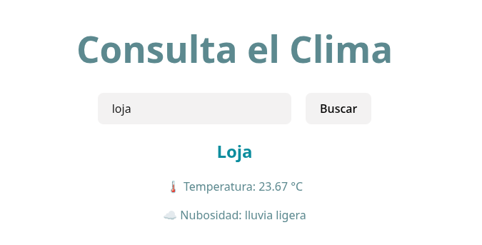

# WeatherApp - Mi Primera Práctica con React

Este proyecto es una practica de una aplicación en **React** que consume datos de una **API externa**, en este caso la API de **OpenWeather**.

## Descripción

La aplicación permite al usuario:

- Ingresar el nombre de una ciudad.
- Consultar el clima actual de esa ciudad.
- Mostrar información relevante del clima, como temperatura, descripción y otros datos proporcionados por la API.
- Se incorporan **estilos básicos** para probar el **CSS** y la **estructura HTML** de los componentes al momento que React los renderiza.

## Captura de la aplicación

  

<i>Pantalla principal de la aplicación mostrando el clima</i>

## Componentes

1. **CitySearch**: Permite ingresar la ciudad y buscar el clima.
2. **AnswerWeather**: Muestra la información del clima obtenida desde la API.

## Tecnologías

- **React**: Librería para construir interfaces de usuario.
- **JavaScript**: Lenguaje principal del proyecto.
- **Fetch API**: Para consumir la API de OpenWeather.
- **CSS básico**: Para estilos simples y estructura visual.
